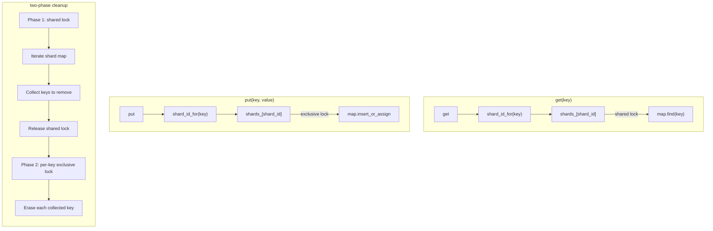

# shardmap Internals

This document describes the internal architecture and implementation details of shardmap. For basic usage, see [README.md](README.md).

## Architecture

### Components

| Component | Purpose |
|-----------|---------|
| `ShardMap<K, V, Metadata, Config>` | Main sharded cache container |
| `ShardMapConfig` | Compile-time configuration (NTTP aggregate) |
| `SpinRWLock` | Lightweight reader-writer lock for per-shard synchronization |
| `GetAction` | Enum for get() callback actions (`Accept`, `Reject`, `Invalidate`) |
| `CleanupResult` | Return type for cleanup operations (`{removed, shard_id}`) |
| `Nullable` | Concept to detect types that can represent "no value" |

### Data Flow



## Sharding

### Shard Selection

Keys are mapped to shards via high-quality hash functions:

```cpp
static uint8_t shard_id_for(const K& key) {
    if constexpr (std::is_integral_v<K>) {
        // Fibonacci hash: multiply + shift (~1ns for integers)
        return static_cast<uint8_t>(
            (static_cast<uint64_t>(key) * 11400714819323198485ULL)
            >> (64 - Config.shard_count_log2)
        );
    } else {
        // Abseil hash for non-integral types (strings, structs)
        return static_cast<uint8_t>(
            absl::Hash<K>{}(key) >> (64 - Config.shard_count_log2)
        );
    }
}
```

**Fibonacci hashing** uses the golden ratio constant (`2^64 / φ ≈ 11400714819323198485`) to scatter sequential integers across shards. This produces excellent distribution even for consecutive keys like `{1, 2, 3, ...}`, where a simple modulo would cluster entries.

### Shard Structure

Each shard is cache-line aligned to prevent false sharing:

```cpp
static constexpr size_t kCacheLineSize = 64;

struct alignas(kCacheLineSize) Shard {
    mutable SpinRWLock mutex;
    absl::flat_hash_map<K, Entry> map;
};

std::array<Shard, kShardCount> shards_;
```

The `mutable` on `mutex` allows `get()` to be `const`-qualified (it only takes shared locks).

## Two-Phase Cleanup

Unlike traditional concurrent maps that erase entries while holding an exclusive lock over the entire iteration, shardmap uses a **two-phase** approach:

### Phase 1: Evaluate (shared lock)

```cpp
std::vector<K> keys_to_remove;
{
    std::shared_lock lock(shard.mutex);
    keys_to_remove.reserve(shard.map.size() / 4);  // Heuristic: ~25% removal

    for (const auto& [key, entry] : shard.map) {
        if (should_remove(key, entry.metadata, ctx))
            keys_to_remove.push_back(key);
    }
} // shared lock released
```

**Reads continue unblocked** during predicate evaluation. The shared lock prevents entry erasure by concurrent `invalidate()` or `put()` calls, but allows concurrent `get()` operations.

### Phase 2: Erase (per-key exclusive lock)

```cpp
size_t removed = 0;
for (const K& key : keys_to_remove) {
    std::unique_lock lock(shard.mutex);
    if (shard.map.erase(key))
        ++removed;
}
```

Each key is erased individually under an exclusive lock. The lock is released between erasures, allowing interleaved reads and writes.

### Benign TOCTOU

Between Phase 1 and Phase 2, a concurrent `put()` may refresh an entry that was marked for removal. The erase will remove the fresh value, causing one unnecessary cache miss. This is **self-healing**: the next access re-caches the value from the backend.

This trade-off is deliberate — it avoids re-evaluating the predicate under exclusive lock (which would block all readers for the entire cleanup duration).

### Shard Rotation

Partial cleanup (`cleanup()` and `try_cleanup()`) processes one shard per call, advancing through shards via an atomic counter:

```cpp
const uint8_t sid = cleanup_cursor_.fetch_add(1, std::memory_order_relaxed)
                    & static_cast<uint8_t>(kShardMask);
```

After `shard_count()` calls, all shards have been processed.

### ShouldRemove Overloads

The removal predicate is auto-detected via `std::is_invocable_v`:

```cpp
if constexpr (std::is_invocable_v<ShouldRemove, const K&, const V&, const Metadata&, const Context&, uint8_t>) {
    should_erase = should_remove(key, entry.value, entry.metadata, ctx, sid);
} else if constexpr (std::is_invocable_v<ShouldRemove, const K&, const Metadata&, const Context&>) {
    should_erase = should_remove(key, entry.metadata, ctx);
} else {
    should_erase = should_remove(key, entry.value, entry.metadata, ctx);
}
```

The 3-parameter form (key, metadata, context) is the most efficient — it avoids accessing the value at all, which can avoid cache-line fetches if the value is large.

## SpinRWLock

A lightweight reader-writer lock using a single `atomic<uint32_t>`:

```
Bit 31      = writer flag
Bits 0-30   = reader count (supports up to ~2 billion concurrent readers)
```

### Reader fast path (~5ns uncontended)

```cpp
void lock_shared() noexcept {
    uint32_t prev = state_.fetch_add(1, std::memory_order_acquire);
    if (__builtin_expect((prev & kWriterBit) == 0, 1))
        return;  // Fast path: no writer, done

    // Slow path: writer present, undo and spin
    state_.fetch_sub(1, std::memory_order_release);
    // ... spin until writer clears
}
```

The fast path is a single atomic operation. The `__builtin_expect` hint tells the compiler that the no-writer case is overwhelmingly likely.

### Writer acquisition (two-phase)

1. **Set writer bit** via `fetch_or` — this blocks new readers from entering
2. **Wait for existing readers to drain** — spin on reader count

```cpp
void lock() noexcept {
    // Phase 1: claim writer bit (fetch_or — can't livelock from readers)
    while (state_.fetch_or(kWriterBit, std::memory_order_acquire) & kWriterBit) {
        while (state_.load(std::memory_order_relaxed) & kWriterBit)
            JCX_SPIN_PAUSE();
    }
    // Phase 2: wait for readers to drain
    while ((state_.load(std::memory_order_acquire) & kReaderMask) != 0) {
        JCX_SPIN_PAUSE();
    }
}
```

**Writer-preference**: once a writer sets the flag, new readers back off. This prevents writer starvation under heavy read load.

### Platform-specific pause

```cpp
#if defined(__x86_64__) || defined(_M_X64)
    #define JCX_SPIN_PAUSE() _mm_pause()
#elif defined(__aarch64__) || defined(_M_ARM64)
    #define JCX_SPIN_PAUSE() asm volatile("yield" ::: "memory")
#else
    #define JCX_SPIN_PAUSE() ((void)0)
#endif
```

`_mm_pause()` on x86 reduces pipeline stalls and power consumption during spin-wait. `yield` on ARM hints the processor to switch to another hardware thread.

## Tuning

### Shard Count

Shard count is configured at compile time via `ShardMapConfig::shard_count_log2`. More shards reduce contention but increase memory overhead (one `SpinRWLock` + `flat_hash_map` per shard).

Each `cleanup()` call processes one shard. With N shards, each call processes approximately `total_entries / N` entries:

| Total entries | 4 shards | 8 shards (default) | 16 shards |
|---------------|----------|---------------------|-----------|
| 10,000 | ~2,500/cleanup | ~1,250/cleanup | ~625/cleanup |
| 100,000 | ~25,000/cleanup | ~12,500/cleanup | ~6,250/cleanup |

### Recommendations

| Scenario | Recommendation |
|----------|----------------|
| Strict latency requirements | More shards to keep per-cleanup batch small |
| Simple workloads | 4-8 shards (default) is sufficient |
| Large caches with high read concurrency | 8-16 shards to reduce reader contention |
| Few entries (< 1,000) | 2-4 shards to avoid overhead |

## Performance Characteristics

| Operation | Time Complexity | Lock type | Notes |
|-----------|-----------------|-----------|-------|
| `get()` (simple) | O(1) average | Shared | Concurrent with other reads |
| `get(callback)` | O(1) average | Shared | Callback under shared lock |
| `put()` | O(1) amortized | Exclusive | Per-shard exclusive lock |
| `invalidate()` | O(1) average | Exclusive | Per-shard exclusive lock |
| `invalidate(pred)` | O(1) average | Exclusive | Find + conditional erase |
| `cleanup()` | O(S) | Shared + per-key exclusive | S = entries in one shard |
| `full_cleanup()` | O(N) | Shared + per-key exclusive | N = all entries |
| `size()` | O(shards) | Shared per shard | Iterates all shards |

## Implementation Details

### Entry Structure

```cpp
struct Entry {
    V value;
    [[no_unique_address]] Metadata metadata;
};
```

- `Metadata` is a template parameter (default: `std::monostate`)
- `[[no_unique_address]]` ensures zero size overhead when `Metadata = std::monostate`
- Value stored by value (no pointer indirection)

### GetAction Enum

```cpp
enum class GetAction : uint8_t {
    Accept,      // Return the value, keep entry
    Reject,      // Return "not found", keep entry
    Invalidate   // Return "not found", erase entry (deferred under exclusive lock)
};
```

### Deferred Invalidation in get()

When a callback returns `GetAction::Invalidate`, the entry is not erased immediately (we're under a shared lock). Instead:

1. Record `needs_invalidation = true`
2. Release shared lock
3. Take exclusive lock
4. Erase the entry

This introduces a benign TOCTOU window (see "Benign TOCTOU" above).

### Nullable Type Detection

```cpp
template<typename T>
struct is_nullable : std::false_type {};

template<typename T> struct is_nullable<std::optional<T>> : std::true_type {};
template<typename T> struct is_nullable<std::shared_ptr<T>> : std::true_type {};
template<typename T> struct is_nullable<std::unique_ptr<T>> : std::true_type {};
template<typename T> struct is_nullable<T*> : std::true_type {};

template<typename T>
concept Nullable = is_nullable<std::remove_cv_t<T>>::value;
```

The `GetResult` type alias selects the appropriate return type:

```cpp
using GetResult = std::conditional_t<Nullable<V>, V, std::optional<V>>;
```

### Cleanup Coordination

A single `atomic<bool>` prevents concurrent cleanup operations:

```cpp
std::atomic<bool> cleanup_in_progress_{false};
```

- `try_cleanup()`: Returns `nullopt` if cleanup is already in progress
- `cleanup()`: Spins until the flag is available, then proceeds
- `full_cleanup()`: Same as `cleanup()`, but iterates all shards while holding the flag

### Memory Ordering

- **Relaxed**: Shard cursor increment, statistics counters
- **Acquire/Release**: Lock operations, cleanup coordination flag
- **Seq_cst**: Not used (unnecessary overhead)